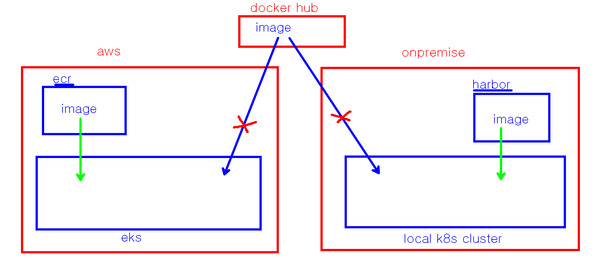

### image-backend:1.0 , image-frontend:1.0  이미지를 생성해서 Docker hub 에 업로드 해 보세요.

```bash

# Dockerfile 이 존재하는 폴더에 들어가서 이미지 생성하기
docker build -t  계정/이미지명:tag  . 
docker build -t  myoli999/image-backend:1.0  .
docker build -t  myoli999/image-frontend:1.0  .

# docker hub 에 push 하기
docuer push  계정/이미지명:tag 
docker push  myoli999/image-backend:1.0
docker push  myoli999/image-frontend:1.0
```

### container 이미지를 저장하는 곳 

